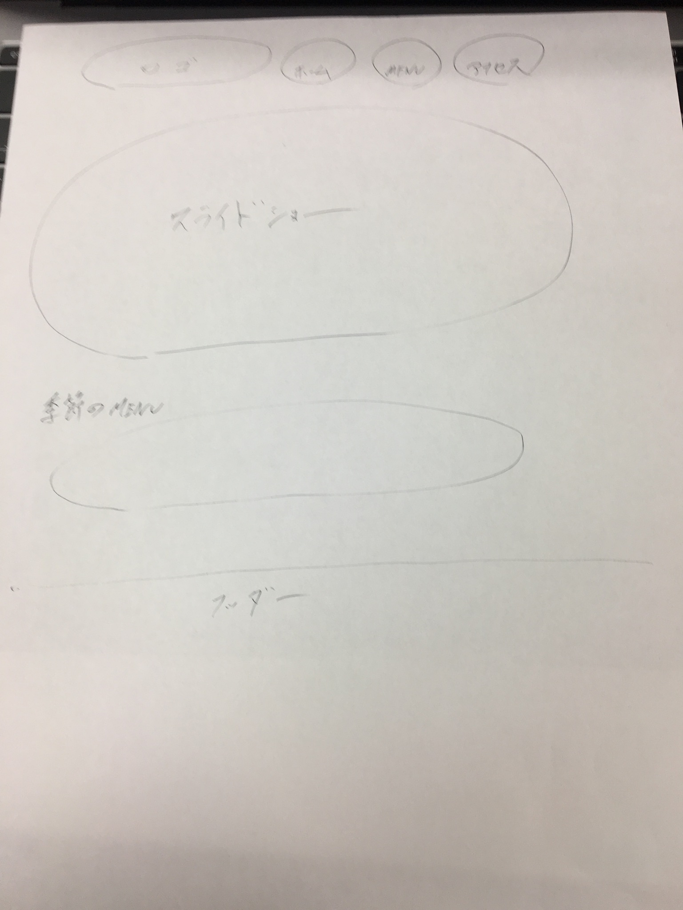

# チーム開発コンペ作品

## チーム名
チームA

## メンバー名
- 森賢哉
- 片田恭平
- 中野湧仁
- 金子正樹
- 大久保優太

## 作品の説明

## classの命名規則
先頭にページ名を入れ単語ごとに「-」を入れ定義する

## CSSリセット
sanitize.css

## Webサイトのラフスケッチ

## カラーパレット
ベースカラー：(110, 60, 32, 1) 
ライトメインカラー：(,,,) 
メインカラー：(255, 231, 181, 1) 
ダークメインカラー：(,,,) 
アクセントカラー：(255, 255, 255, 1) 

## タイポグラフィ
font-family: 'Comic Sans MS',sans-serif;

## 担当
ヘッダー：森賢哉 
フッター：大久保優太 
トップ：金子正樹 
メニュー：中野湧仁 
アクセス：片田恭平 